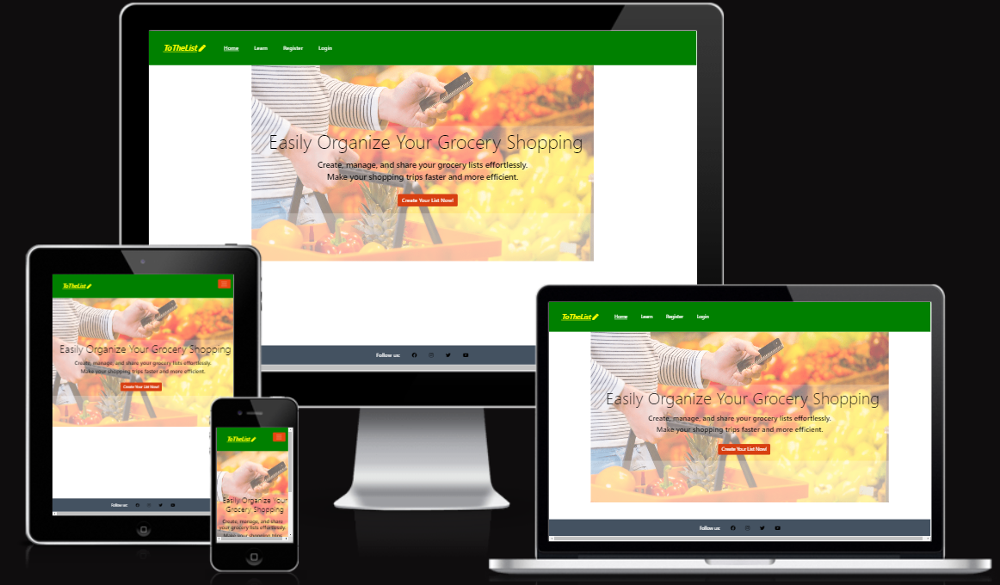
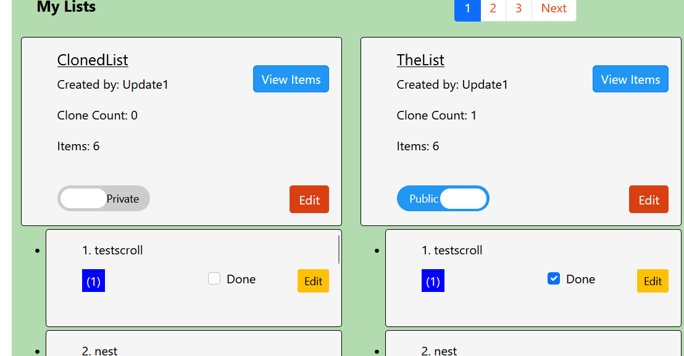
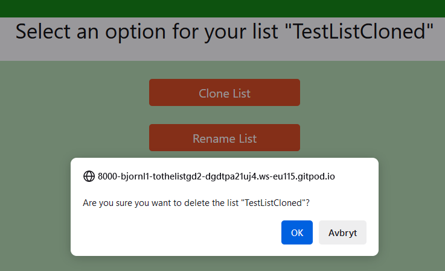
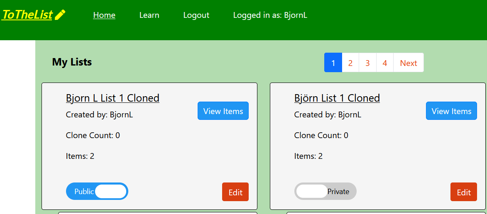

# TO THE LIST

ToTheList is a website intended to empower users with functionality for tracking, sharing, and editing shopping items. Additionally, the platform is well-suited for planning activities, including managing to-do tasks. 

The live link can be found here - [ToTheList](https://tothelist-gd-20bd5040c185.herokuapp.com/)

## Table of Contents

- [TO THE LIST](#to-the-list)
  - [Table of Contents](#table-of-contents)
  - [User Experience (UX)](#user-experience-ux)
    - [User Stories](#user-stories)
      - [EPIC | User Profile](#epic-user-profile)
      - [EPIC | User Navigation](#epic-user-navigation)
      - [EPIC | Lists Interaction](#epic-lists-interaction)
      - [EPIC | Items Interaction](#epic-items-interaction)
      - [EPIC | Site Administration](#epic-site-administration)
      - [User stories not yet implemented](#user-stories-not-yet-implemented)
    - [Design](#design)
      - [Colour Scheme](#colour-scheme)
      - [Imagery](#imagery)
      - [Fonts](#fonts)
      - [Wireframes](#wireframes)
  - [Agile Methodology](#agile-methodology)
  - [Data Model](#data-model)
  - [Testing](#testing)
  - [Security Features and Defensive Design](#security-features-and-defensive-design)
    - [User Authentication](#user-authentication)
    - [Form Validation](#form-validation)
    - [Database Security](#database-security)
    - [Custom error pages:](#custom-error-pages)
  - [Features](#features)
    - [Header](#header)
    - [Footer](#footer)
    - [Home Page](#home-page)
    - [User Account Pages](#user-account-pages)
    - [List management](#list-management)
    - [Item management](#item-management)
    - [Future Features](#future-features)
  - [Deployment - Heroku](#deployment---heroku)
    - [Create the Heroku App:](#create-the-heroku-app)
    - [Attach the Postgres database:](#attach-the-postgres-database)
    - [Prepare the environment and settings.py file:](#prepare-the-environment-and-settingspy-file)
    - [Create files / directories](#create-files--directories)
    - [Update Heroku Config Vars](#update-heroku-config-vars)
    - [Deploy](#deploy)
  - [Forking this repository](#forking-this-repository)
  - [Cloning this repository](#cloning-this-repository)
  - [Languages](#languages)
  - [Frameworks - Libraries - Programs Used](#frameworks---libraries---programs-used)
  - [Credits](#credits)
  - [Acknowledgments](#acknowledgments)

## User Experience (UX)

A typical user of ToTheList is someone who wants to efficiently manage their shopping lists and facilitate seamless sharing with family and friends, allowing others to contribute and update items collaboratively.

### User Stories

#### EPIC User Profile
- As a Site User, I can register an account so that I can create, read, update and delete my lists and items.
- As a Site User, I can log in or log out of my account so that I can keep my account secure.
- As a Site User I can see my login status so that I know if I'm logged in or out.

#### EPIC User Navigation
- As a Site User, I can immediately understand the purpose of the site so that I can decide if it meets my needs.
- As a Site User, I can intuitively navigate around the site so that I can find content and understand where I am on the site.
- As a Site User, I can view which items belong to each list so that I don't misunderstand which items belong to which list.

#### EPIC Lists interaction
- As a Site User, I can create lists so that I can easily organize items.
- As a Site User, I can rename a list so that I don't need to delete and recreate a new list if I accidentally named it wrong.
- As a Site User, I can delete lists so that I can remove ones that are no longer needed.
- As a Site User, I can view and copy an existing list created by another user so that I can reuse items in my own lists.
- As a Site User, I can set my lists to be private or public so that I can control whether I want to share my lists and let other users add items to my public list.
- As a Site User, I can see how frequently my lists are copied, so that I can adapt and prioritize sharing lists that are most meaningful. 

#### EPIC Items interaction
- As a Site User, I can add and view items to a list so that I can easily store and find my items.
- As a Site User, I can rename an item so that I don't need to delete and recreate a new item if I accidentally named it wrong.
- As a Site User, I can delete items so that I can remove ones that are no longer needed.

#### EPIC Site Administration
- As a Site Administrator, I can create, read, update and delete lists and items.

#### User stories not yet implemented

The following user stories were scoped out of the project due to time constraints and labeled as "Won't Have" on the project board on Github. It is intended that these user stories will be implemented at a later date. 

- As a Site User, I can move items between different lists so that I can increase flexibility of item management.
- As a Site User, I can search and filter lists so that I can find lists based on specific search criteria.

### Design

The site's intentionally simple and clean design reflects its overarching goal: to cultivate a serene and organized environment that aligns with its purpose. By embracing minimalism, it aims to evoke a sense of tranquility and provide users with a clutter-free space conducive to efficient organization.

#### Colour Scheme
Colour created in Coolors.

The color scheme of the site predominantly features a blend of green and celadon (light gray). The primary focus was on maintaining a distinct header while ensuring that the background color for sign-in/up/out pages and list/item views is calm yet clearly delineates and distinguishes the content for the user.

The color palette was created using Coolors, while extracting the colors from the website was accomplished using Pick Color Online

#### Imagery
The site features a singular static image of a person holding a shopping basket filled with groceries in one hand and a phone in the other, symbolizing the concept of a shopping list.

#### Fonts
The Montserrat font is the main font used for the body of the website with the Playfair Display font used for the main headings on the home page. These fonts were imported via Google Fonts. Sans Serif is the backup font, in case for any reason the main font isn't being imported into the site correctly.

#### Wireframes

 
Landing Page Browser

Sign Up/Sign In Browser

Lists and Items Browser

 
Landing Page

Sign Up/Sign In

Lists and Items

## Agile Methodology

Github projects was used to manage the development process using an agile approach. Please see link to project board [here](https://github.com/users/BjornL1/projects/6)

The 5 Epics listed above were documented within the Github project as Milestones. A Github Issue was created for each User Story which was then allocated to a milestone(Epic). Each User Story has defined acceptance criteria to make it clear when the User Story has been completed. The acceptance criteria are further broken down into tasks to facilitate the User Stories execution.

## Data Model
I used principles of Object-Oriented Programming throughout this project and Django’s Class-Based Generic Views.  

Django AllAuth was used for the user authentication system.

To facilitate the management of shopping lists, a custom ShoppingList model was developed. Each shopping list is associated with a single user who acts as its owner. Therefore, the owner attribute of the ShoppingList model is a foreign key to the User model.

In addition to the ShoppingList model, a ShoppingListPreference model was implemented to handle user preferences related to shopping lists. This model allows users to specify whether a shopping list should be deleted or retained. . The user attribute of the ShoppingListPreference model is a foreign key to the User model, indicating that each preference setting is linked to a single user. Similarly, the shopping_list attribute is a foreign key to the ShoppingList model, indicating that each preference setting corresponds to a specific shopping list.

Furthermore, the Item model represents individual items within a shopping list. Each item is associated with a single shopping list, represented by the shopping_list attribute, which is a foreign key to the ShoppingList model. Additionally, the created_by attribute of the Item model signifies the user who created the item, and it is a foreign key to the User model, indicating that each item is linked to its creator.

The diagram below details the database schema.

## Testing

Testing and results can be found [here](/TESTING.md)

## Security Features and Defensive Design

### User Authentication

- Django's LoginRequiredMixin is used to make sure that any requests to access secure pages by non-authenticated users are redirected to the login page. 

### Form Validation
If incorrect or empty data is added to a form, the form won't submit and a warning will appear to the user informing them what field raised the error. 

### Database Security
The database url and secret key are stored in the env.py file to prevent unwanted connections to the database and this was set up before the first push to Github.

Cross-Site Request Forgery (CSRF) tokens were used on all forms throughout this site.

### Custom error pages:

Custom Error Pages were created to give the user more information on the error and to provide them with buttons to guide them back to the site.

- 400 Bad Request - ToTheList is unable to handle this request.
- 403 Page Forbidden - Looks like you're trying to access forbidden content. Please log out and sign in to the correct account.
- 404 Page Not Found - The page you're looking for doesn't exist.
- 500 Server Error - ToTheList is currently unable to handle this request

## Features

### Home Page

- The homepage comprises several key features and pieces of information designed to enhance user interaction:

Logo: Positioned prominently, the logo serves as a visual identifier for the platform, fostering brand recognition and trust.

Header: The navigation bar in the header offers intuitive access to various sections and functionalities of the platform, ensuring seamless user experience and easy exploration.

'Create Your List Now!' Button: A prominent call-to-action button invites users to initiate list creation swiftly. Placed strategically, this button encourages immediate engagement and facilitates the creation of new lists.

Homepage Information: Informative content provides users with an overview of the platform's features and benefits. This information aims to orient users, helping them understand the platform's value proposition and encouraging further exploration.

### Header

All navigation links will appear in bold when hovered over, and they will be underlined when active.

**Logo**
- The logo is positioned in the top left of the navigation bar. The logo is linked to the home page for ease of navigation for the user.

**Navigation Bar**

- The navigation bar is consistently located at the top of every page, providing users with convenient access to various sections and functionalities of the platform. Depending on whether the user is logged in or not, the header will dynamically display different links, offering tailored navigation options.

- On smaller screens, such as mobile devices, the header links are concealed under a hamburger button. Upon clicking this symbol, the links are revealed, allowing users to easily navigate through the platform's content.

The header offers various options, including: Home, Learn, Register, Login, Logged in as, and Logout.
- 'Home' provides easy access to the homepage.
- 'Learn' offers a site description and instructions for users.
- 'Register' presents a signup form for creating a new account.
- 'Login' directs users to the sign-in page.
- 'Logout' provides a sign-out option for users to log out of their accounts.
- 'Logged in as:' displays the name of the currently logged-in user.

***Logged-out user***

- The header displays the following options: 'Home', 'Learn', 'Register', and 'Login'.

***Logged-in user***

- The header displays the following options: 'Home', 'Learn', 'Logout', and 'Logged in as:'.

### Footer

- The footer section includes links to Facebook, Instagram, Twitter and Youtube.
- Clicking the links in the footer opens a separate browser tab to avoid pulling the user away from the site.

### User Account Pages

**Sign Up**

**Log In**

**Log Out**

- Django allauth was installed and used to create the Sign up, Login and Log out functionality. 

### List management
All lists include the following information: Name, Number of Items (quantity), Clone Count, Public/Private status (button for list owner), View Items button, Edit/Clone Button.
Their presentation and options depend on whether the user owns the list or not. All lists owned by the logged-in user will be displayed first under the heading 'My Lists,' while public lists owned by other users are displayed under 'Other Lists'."

For lists owned by the logged-in user, the following additional information will be displayed:

- Name
- Created by:
- Clone Count:
- Items:
- Public/Private Toggle Button: For each list, a toggle switch displays the status of the list.
- View Items Button (to view and direcly edit specific items)
- Edit button: This button leads to an editing page where the user can choose to clone, rename, or delete the list, or access the items that belong to the list.

For a logged-in user, the following information will be presented for lists in the section for other lists:

- Name
- Created by:
- Clone Count:
- Items:
- Public status text
- View Items Button (to view which items belongs to the list).
- Clone Button: This button is for cloning a public list, the cloned list will be owned by the logged in user.

**My Lists**

If the logged-in user has created lists, they will be displayed at the top of the page.
Any items in the list will be linked under the card and will be scrollable directly below the card if the user clicks on the list title.
In the example below, a list has been cloned once. It contains 2 items, one of which has been marked as done. The list is set to "public" and the edit button is visible since the logged-in user owns the list. 

**Other Lists**

In this section of the page, public lists are listed under 'Other Lists.'

**Create and cloning lists**

A list can be created from four different locations:

1. Logged-out users: They can create a list by clicking the "Add list" button on the homepage.
    - Click the "Create Your List Now!" button on the landing page-> Sign-in form is displayed.
    - Enter login credentials or sign up. Click "Sign in" or "Sign Up" -> Create list form is displayed.
    - Enter a name for the list and click "Create" -> The list is created and user is directed to an add items page.
    - On the add item list page click "Show Lists" -> The latest created list will be displayed on the list view.

2. Logged-in: "Add list" button from list view.
    - Click the "Add list" button from list view -> Create list form is displayed.
    - Repeat the same steps as stated under point nr 1 in the previous section.

3. Logged-in: By cloning a list using clone via the "Edit" button on the list view.
    - From the list view, click on the "Edit" button. -> An edit page will be displayed.
    - From the edit page, click on the "Clone list" button -> Create list form is displayed.
    - Success message displayed along with a close button, close and the list will be displayed.

4. Logged-in: By cloning a list using the "Clone" button on the list view.
    - From the list view, click on the "Clone" button. -> A clone list page will be displayed.
    - Enter a name for the list and click "Clone list" -> The newly created list is confirmed with a message and a close button.
    - Click the "Close" button-> The latest created list will be displayed on the list view, the clone count for the list that was cloned will increase by 1.

In the image below, you can see an example of how the list "BjornL List 1" is displayed before cloning the list.

In the image below, the list has been cloned and renamed to "BjornL List 1 Cloned".

**Rename a list**

A logged-in user can rename a list from the list view by following these steps:

  - Click on the "Edit" button for the list. This action will direct the user to a page with various edit options.
  - On the edit options page, locate and click the "Rename list" button. This will bring up a dedicated renaming page.
  - On the renaming page, enter the desired new name for the list.
  - After entering the new name, click on the "Rename List" button to confirm the changes.
  - A message will promptly appear, confirming the successful renaming of the list along with the new name. Additionally, a "Close" button will be provided.
  - To return to the list view, simply click on the "Close" button.

In the image below, there is an example of how the list "BjornL List 1" is displayed before renaming the list.

**Delete a list**

A logged-in user can delete a list from the list view by following these steps:

  - Click on the "Edit" button for the list. This action will direct the user to a page with various edit options.
  - On the edit options page, locate and click the "Delete list" button. This will prompt a confirmation message box, ensuring the user wants to delete the list.
  - Click "OK" to proceed with the deletion. After the list is deleted, a confirmation page will be displayed. Additionally, a "Close" button will be provided.
  - To return to the list view, simply click on the "Close" button.

In the image below, there is an example of a confirmation message before deleting the list

**Change public and private status**

The owner of a list can adjust its privacy settings, toggling between public and private modes, by following these steps:

- To change a list from public to private:
  - Click the toggle symbol. This action will prompt the toggle symbol to move, and the accompanying information text will switch from "public" to "private".

- To change a list from private to public:
  - Click the toggle symbol. Similar to the previous step, this action will cause the toggle symbol to move, and the information text will change from "private" to "public".

In the image below, there is an example of a public and private list positioned next to each other. Please note the text displayed in the blue box and the position of the toggle switch.

**View items in a list**

1. For a user owning the list:
   - Click on the list title. This action will display all items directly under the list. To hide the items, simply click on the list title again.
2. For a user owning the list:
   - Click on the "Edit" button for the list. This will direct the user to a page with various edit options.
   - On the edit options page, locate and click the "Items" button. This action will display the items on a separate page.
   - To return to the previous pages, simply use the browser's back button.
3. For a user viewing other users' public lists:
   - Click on the list title in the "Other Lists" section. This will display the list items on a separate page.
   - To return to the previous pages, use the browser's back button.

### Item management
All items are associated with a list and can be added either by creating them or by cloning other lists and their items.
Moreover, users have the ability to rename and delete items.
Each item in a list owned by the logged-in user can be marked as 'done' or 'not done' (when the checkbox is not checked).
The owner of an item has full editing access to it. For public lists (the "other lists" section), a logged-in user can only view the items in these lists.

At the bottom of the separated item page, a "Back to Top" button will appear when the user scrolls down, providing an effortless way to return to the top of the page.

**Create and cloning items**

1. From the list view:
   - Click on the "Edit" button for the list. This action will direct the user to a page with various edit options.
   - On the edit options page, locate and click the "Show Items" button. This will bring up a dedicated items page. 
   - On the item page, click on the "Add item" button, and an item adding page will be displayed.
   - Enter a new name and click on the "Add item" button to confirm the changes.
   - The new item will be displayed on the dedicated items page.
   - Use the Show List button to return to the list page.
2. From the list view:
   - Click on the "Edit" button for the list. This action will direct the user to a page with various edit options.
   - On the edit options page, locate and click the "Show Items" button. This will bring up a dedicated items page.
   - On the items page, locate the item you wish to clone and click on its "Edit" button. This action will display the edit item page.
   - On the edit item page, click on the "Duplicate Item" button. This will prompt the display of a duplicate item page.
   - Enter a name for the duplicated item and click on "Duplicate Item". A message will appear, confirming the duplication.
   - A confirmation page will then be displayed, showing the name of the duplicated item along with a "Close" button.
   - Click on the "Close" button to return to the item view.
3. From the list view:
    - From the list view, click on a list containing items.
    - Click on an item with the "Edit" button visible. This action will display the edit item page.
    - On the edit item page, click on the "Duplicate Item" button. This will prompt the display of a duplicate item page.
    - Enter a name for the duplicated item and click on "Duplicate Item". A message will appear, confirming the duplication.
    - A confirmation page will then be displayed, showing the name of the duplicated item along with a "Close" button.
    - Click on the "Close" button to return to the list item.

In the image below, you can see an example of how the item "testid" is displayed before duplicating the item.

**Rename items**

A logged-in user can rename an item from the list view by following these steps:

1. From the list view:
   - Click on the "Edit" button for the list. This action will direct the user to a page with various edit options.
   - On the edit options page, locate and click the "Show Items" button. This will bring up a dedicated items page.
   - On the items page, locate the item you wish to rename and click on its "Edit" button. This action will display the edit item page.
   - On the edit item page, click on the "Rename item" button. This will prompt the display of a rename item page.
   - Enter a name for the duplicated item and click on "Rename item". A message will appear, confirming the duplication.
   - A confirmation page will then be displayed, showing the name of the renamed item along with a "Close" button.
   - Click on the "Close" button to return to the item view.

2. From the list view:
   - Click on a list containing items.
   - Click on an item with the "Edit" button visible. This action will display the edit item page.
   - On the edit item page, click on the "Rename" button. This will prompt the display of a rename item page.
   - Enter a name for the duplicated item and click on "Rename item". A message will appear, confirming the duplication.
   - A confirmation page will then be displayed, showing the name of the duplicated item along with a "Close" button.
   - Click on the "Close" button to return to the item view.

In the image below, you can see an example of how the item "testid" is displayed before renaming the item.

**Delete items**

1. From the list view:
   - Click on the "Edit" button for the list. This action will direct the user to a page with various edit options.
   - On the edit options page, locate and click the "Show Items" button. This will bring up a dedicated items page.
   - On the items page, locate the item you wish to delete and click on its "Edit" button. This action will display the edit item page.
   - On the edit item page, click on the "Delete" button. This will prompt the display of a delete item confirmation page.
   - Confirm the deletion by clicking on the appropriate button. A message will appear, confirming the deletion.
   - A confirmation page will then be displayed, showing the deleted item's details along with a "Close" button.
   - Click on the "Close" button to return to the item view.

2. From the list view:
   - Click on a list containing items.
   - Click on an item with the "Edit" button visible. This action will display the edit item page.
   - On the edit item page, click on the "Delete" button. This will prompt the display of a delete item confirmation page.
   - Confirm the deletion by clicking on the appropriate button. A message will appear, confirming the deletion.
   - A confirmation page will then be displayed, showing the deleted item's details along with a "Close" button.
   - Click on the "Close" button to return to the item view.

   
In the image below, you can see an example of how the item "Bread" is confirmed to be deleted.

**Change an item to done**

Changing an item from not done to done can be done either directly from the list view for a user's own list or by accessing 
the items through the edit button on the list view.

1. From the list view, logged-in users list:
   - Click on the title of the list, click on the done checkbox shown for each item.
2. From the list view, other lists, item owned by logged-in user:
   - Click on the "Edit" button. This action will direct the user to a page with various edit options.
   - On the edit options page, locate and click the "Items" button. This will bring up a dedicated items page.
   - Click on click on the done checkbox shown for the items displayed.  

In the image below, you can see an example of how the two items in the separated page item view, where one item is marked as done.

### Error Pages

Custom Error Pages were created to give the user more information on the error and to guide them back to the site.

Example below for a 404 page.

- 400 Bad Request - ToTheList is unable to handle this request.
- 403 Page Forbidden - Looks like you're trying to access forbidden content. Please log out and sign in to the correct account.
- 404 Page Not Found - The page you're looking for doesn't exist.
- 500 Server Error - ToTheList is currently unable to handle this request

### Future Features
The following user stories were scoped out of the project due to time constraints and labeled as "Could Have" on the project board in Github. It is intended that these user stories will be implemented at a later date. 

- As a Site User, I can move items between different lists so that I can increase flexibility of item management.
- As a Site User, I can search and filter lists so that I can find lists based on specific search criteria.

Other potential features include:
- Adding additional functionality, such as creating a flexible template that includes the ten most popular items currently. This template would be continuously updated based on statistics.
- Allowing users to utilize the template when creating their own lists by incorporating the most popular items at the moment.

## Deployment - Heroku

To deploy this page to Heroku from its GitHub repository, the following steps were taken:

### Create the Heroku App:
- Log in to [Heroku](https://dashboard.heroku.com/apps) or create an account.
- On the main page click the button labeled New in the top right corner and from the drop-down menu select "Create New App".
- Enter a unique and meaningful app name.
- Next, select your region.
- Click on the Create App button.

### Attach the Postgres database:
- In the Resources tab, under add-ons, type in Postgres and select the Heroku Postgres option.
- Copy the DATABASE_URL located in Config Vars in the Settings Tab.

### Prepare the environment and settings.py file:
- In your GitPod workspace, create an env.py file in the main directory.
- Add the DATABASE_URL value and your chosen SECRET_KEY value to the env.py file. 
- Update the settings.py file to import the env.py file and add the SECRETKEY and DATABASE_URL file paths.
- Comment out the default database configuration.
- Save files and make migrations.
- Add the STATIC files settings - the url, storage path, directory path, root path, media url and default file storage path.
- Link the file to the templates directory in Heroku.
- Change the templates directory to TEMPLATES_DIR
- Add Heroku to the ALLOWED_HOSTS list the format ['app_name.heroku.com', 'localhost']

### Create files / directories
- Create requirements.txt file
- Create three directories in the main directory; media, storage and templates.
- Create a file named "Procfile" in the main directory and add the following: web: gunicorn project-name.wsgi

### Update Heroku Config Vars
Add the following Config Vars in Heroku:
- SECRET_KEY value 
- PORT = 8000
- DISABLE_COLLECTSTATIC = 1

### Deploy
- NB: Ensure in Django settings, DEBUG is False
- Go to the deploy tab on Heroku and connect to GitHub, then to the required repository. 
- Scroll to the bottom of the deploy page and either click Enable Automatic Deploys for automatic deploys or Deploy Branch to deploy manually. Manually deployed branches will need re-deploying each time the repo is updated.
- Click View to view the deployed site.

The site is now live and operational.
## Forking this repository
- Locate the repository at this link [ToTheList](https://github.com/BjornL1/to_the_list_gd2).
- At the top of the repository, on the right side of the page, select "Fork" from the buttons available. 
- A copy of the repository is now created.

## Cloning this repository
To clone this repository follow the below steps: 

1. Locate the repository at this link [ToTheList](https://github.com/BjornL1/to_the_list_gd2). 
2. Under **'Code'**, see the different cloning options, HTTPS, SSH, and GitHub CLI. Click the preferred cloning option, and then copy the link provided. 
3. Open **Terminal**.
4. In Terminal, change the current working directory to the desired location of the cloned directory.
5. Type **'git clone'**, and then paste the URL copied from GitHub earlier. 
6. Type **'Enter'** to create the local clone. 

## Languages

- Python
- HTML
- CSS
- Javascript

## Frameworks - Libraries - Programs Used
- [Django](https://www.djangoproject.com/): Main python framework used in the development of this project
- [Django-allauth](https://django-allauth.readthedocs.io/en/latest/installation.html): authentication library used to create the user accounts
- [PostgreSQL](https://www.postgresql.org/) was used as the database for this project.
- [Heroku](https://dashboard.heroku.com/login) - was used as the cloud based platform to deploy the site on.
- [Responsinator](http://www.responsinator.com/) - Used to verify responsiveness of the website on different devices.
- [Balsamiq](https://balsamiq.com/) - Used to generate Wireframe images.
- [Chrome Dev Tools](https://developer.chrome.com/docs/devtools/) - Used for overall development and tweaking, including testing responsiveness and performance.
- [Font Awesome](https://fontawesome.com/) - Used for icons in the information bar.
- [GitHub](https://github.com/) - Used for version control and agile tool.
- [Google Fonts](https://fonts.google.com/) - Used to import and alter fonts on the page.
- [W3C](https://www.w3.org/) - Used for HTML & CSS Validation.
- [PEP8 Online](http://pep8online.com/) - used to validate all the Python code
- [Jshint](https://jshint.com/) - used to validate javascript
- [Coolors](https://coolors.co/) - Used to create a colour palette.
- [Pick Color Online](https://pickcoloronline.com/) - Used for extracting colour samples from the website.
- [Favicon](https://favicon.io/) - Used to create the favicon symbol next to the logo.
- [Summernote](https://summernote.org/): A WYSIWYG editor to allow users to edit their posts
- [Crispy Forms](https://django-crispy-forms.readthedocs.io/en/latest/) used to manage Django Forms
- [Cloudinary](https://cloudinary.com/): the image hosting service used to upload images
- [Bootstrap 5.0](https://getbootstrap.com/docs/5.0/getting-started/introduction/): CSS Framework for developing responsiveness and styling

## Credits

- [W3Schools](https://www.w3schools.com/)
- [Django Docs](https://docs.djangoproject.com/en/4.0/)
- [Bootstrap 5.0 Docs](https://getbootstrap.com/docs/5.0/getting-started/introduction//)
- [Stack Overflow](https://stackoverflow.com/)
- [Code Institute - Blog Walkthrough Project](https://github.com/Code-Institute-Solutions/Django3blog)

## Acknowledgments

Thanks to my mentor Antonio for his support and advice.
