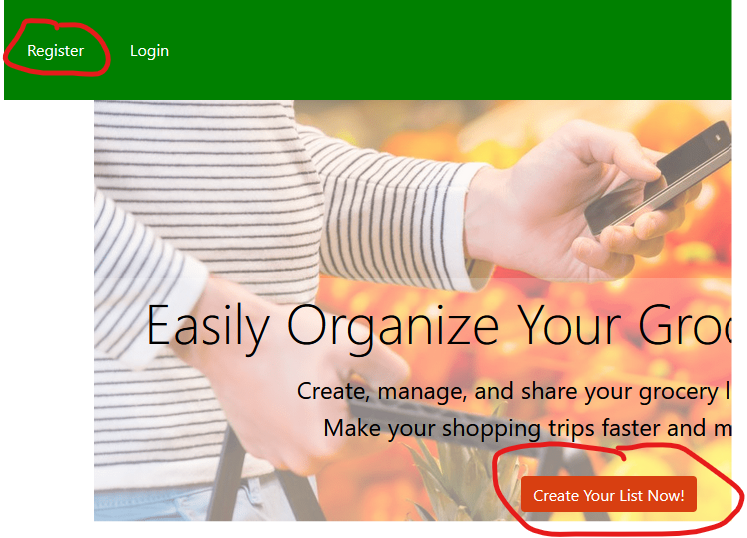
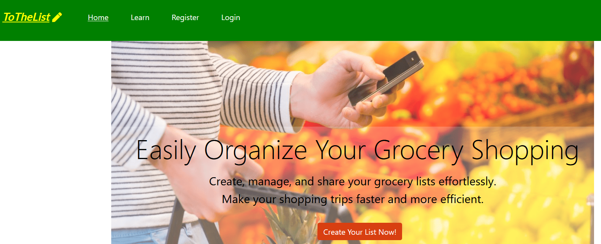
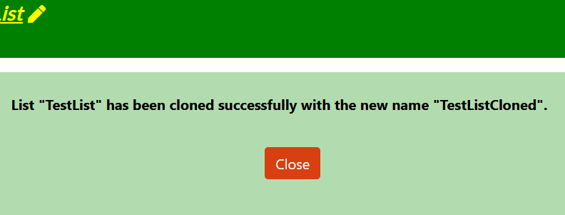
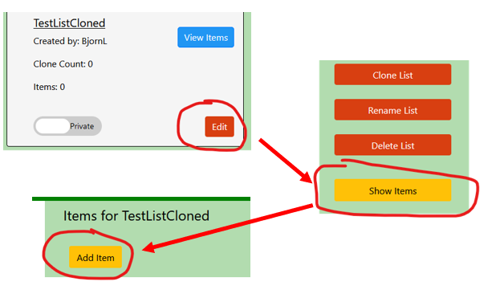

Table of Contents
- [User Story Testing](#user-story-testing)
- [Validator Testing](#validator-testing)
  * [HTML](#html)
    + [Fixed Errors](#fixed-errors)
    + [Unfixed Errors](#unfixed-errors)
  * [CSS](#css)
  * [Javascript](#javascript)
  * [Python](#python)
  * [Lighthouse](#lighthouse)
- [Browser Testing](#browser-testing)
- [Device Testing](#device-testing)
- [Manual Testing](#manual-testing)
  * [Site Navigation](#site-navigation)
  * [Home Page](#home-page)
  * [Browse Recipes Page](#browse-recipes-page)
  * [Recipe Detail Page](#recipe-detail-page)
  * [Add Recipe Page](#add-recipe-page)
  * [Update Recipe Page](#update-recipe-page)
  * [Confirm Delete Recipe Page](#confirm-delete-recipe-page)
  * [My Recipes Page](#my-recipes-page)
  * [My Bookmarks Page](#my-bookmarks-page)
  * [My Meal Plan Page](#my-meal-plan-page)
  * [Django All Auth Pages](#django-all-auth-pages)
- [Bugs](#bugs)
  * [Fixed Bugs](#fixed-bugs)
    + [Overwrite Meal Plan Items](#overwrite-meal-plan-items)
    + [Required fields using Summernote extension submit with just whitespace entered](#required-fields-using-summernote-extension-submit-with-just-whitespace-entered)
    + [No Reverse Match Error](#no-reverse-match-error)
    + [Cloudinary Images not Displaying](#cloudinary-images-not-displaying)
    + [Footer not staying at bottom of screen](#footer-not-staying-at-bottom-of-screen)
  * [Unfixed bugs:](#unfixed-bugs-)

<small><i><a href='http://ecotrust-canada.github.io/markdown-toc/'>Table of contents generated with markdown-toc</a></i></small>

## User Story Testing

### EPIC | User Profile

*As a Site User, I can register an account so that I can create, read, update and delete my lists and items.*

- A "Register" link is prominently displayed in the header, positioned close to the logo.
- Furthermore, a "Sign up" button form is - presented when the user selects "Add list".

*As a Site User, I can log in or log out of my account so that I can keep my account secure.*

- If the user has registered an account, they can access the login and logout buttons directly on the Navbar. For smaller screens, these options are available within the hamburger icon.

*As a Site User I can see my login status so that I know if I'm logged in or out.*

- After logging into their account, the user's username is prominently displayed on the Navbar. For smaller screens, it appears within the hamburger icon.

### EPIC | User Navigation

 *As a User I can immediately understand the purpose of the site so that I can decide if it meets my needs*

- In the center of the landing page, there is a section entitled with an information message that provides a brief overview of what the site has to offer. Additionally, there is a button labeled "Add list" to further emphasize the message.

*As a user, I can intuitively navigate around the site so that I can find content*

- A navigation bar is visible on every page of the site, which is fully responsive across different screen sizes.

*As a Site User, I can view which items belong to each list so that I don't misunderstand which items belong to which list.*

- The list page displays all lists in the database, initially filtered to show 'My lists' first, followed by other public lists.

### EPIC List interaction

*As a Site User, I can create lists so that I can easily organize items.*

- After logging in, public shared lists will be displayed. Additionally, an 'Add list' button will appear."

*As a Site User, I can rename a list so that I don't need to delete and recreate a new list if I accidentally named it wrong*.

- The rename page is accessed from the edit list menu.
- Clicking the "Rename" button displays the page to rename the list.
- After entering a new name and confirming the change, the list name is updated.

*As a Site User, I can delete lists so that I can remove ones that are no longer needed*

- The delete page is accessed from the edit list menu.
- Clicking the delete button displays the confirmation message page, allowing the user to confirm the deletion if needed.
- The deletion of the list is confirmed to the user with a confirmation page.

*As a Site User, I can view and copy an existing list created by another user so that I can reuse items in my own lists*

- By clicking on the edit button in the list view, the option to clone the list is displayed.
- Clicking on "Clone list" will display a page for entering a new name.
- After entering a new name and clicking "Clone list," the new list will be created.
- Confirmation message and the newly cloned list will be displayed as the final step

*As a Site User, I can set my lists to be private or public so that I can control whether I want to share my lists and letting other users adding items to my public list*

- Clicking on a list marked with the toggle switch positioned to the left and labeled as "public" will move the switch to the right position, and the text will be updated from "public" to "private."
- Clicking on a list marked with the toggle switch positioned to the right and labeled as "private" will move the switch to the left position, and the text will be updated from "private" to "public."
- After logging out and logging back in, I can confirm that the latest saved status (public or private) is correctly maintained..

*As a Site User, I can see how frequently my lists are copied, so that I can adapt and prioritize sharing lists that are most meaningful.*

- By viewing the "Clone Count" variable, I can see the number of times the list has been cloned.
- When testing the cloning of a list, I observe that the clone count increases by one for the list that was cloned.

### EPIC Item interaction

*As a Site User, I can add and view items to a list so that I can easily store and find my items.*
- By viewing the item status on the list item, I will immediately see if there are any items in the list.

Add item: Option 1
- Clicking on the "Edit" button on the list card will display the edit menu. From there, selecting "Items" will show the "Add item" button on a separate page.
- When clicking "Add item", a page will prompt the user to enter the name for the new item and click the "Add item" button.
- Upon entering the name and clicking "Add item", the item will be added to the list.

Add item: Option 2.
- Clicking on the list title under the "Other Lists" section will open the items in the list on a separate page. From there, locate the "Duplicate" button displayed on the page.
- Clicking on the "Duplicate" button on the list item will display the duplicate item page. From there, enter the name and click "Duplicate Item".
- A confirmation message is displayed. By clicking "OK", the new item is created and displayed.

In the picture below, Option 1 is displayed.

*As a Site User, I can rename an item so that I don't need to delete and recreate a new item if I accidentally named it wrong.*

Option 1.
- By clicking the "Edit" button on a list card, the edit menu will be displayed.
- Clicking the "Items" button will lead to a separate page with items. From there, click on the edit button displayed after each card, and the option "Rename" will be displayed on a separate item edit menu page.
- Click on the "Rename" button, and a new page is displayed with a name field. Enter the new name and click the "Rename" button.
- A confirmation message is displayed. By clicking "OK", the new name is updated and displayed.

Option 2. 
- By clicking the list title in a list card and locate the edit button for any item displayed directly, from there click the "edit" button and locate the "Rename Item" button that is displayed one the page.
- Click on the "Rename" button, and a new page is displayed with a name field. Enter the new name and click the "Rename" button.
- A confirmation message is displayed. By clicking "OK", the new name is updated and displayed.

Option 3.
- Clicking on the list title under the "Other Lists" section will open the items in the list on a separate page. From there, locate the "Rename Item" button displayed on the page.
- Click on the "Rename" button, and a new page will be displayed with a field for entering the new name. Enter the new name and click the "Rename" button.
- A confirmation message is displayed. By clicking "OK", the new name is updated and displayed.

In the picture below, Option 3 is displayed.

*As a Site User, I can delete items so that I can remove ones that are no longer needed.*

Option 1.
- By clicking the "Edit" button on a list card, the edit menu will be displayed.
- Clicking the "Items" button will lead to a separate page with items. From there, click on the edit button displayed after each card, and the option "Delete" will be displayed on a separate item edit menu page.
- Clicking the "Delete" button prompts a confirmation message. Upon clicking "OK", the item is deleted, and a confirmation message is displayed.

Option 2. 
- Click the list title in a list card to access the edit button for any item displayed. From there, click the "edit" button and locate the "Delete" button displayed on the page.
- Clicking the "Delete" button prompts a confirmation message. Upon clicking "OK", the item is deleted, and a confirmation message is displayed.

Option 3.
- By clicking on the list title, the separate item page is displayed. From there, click on the edit button displayed after each card, and the option "Delete" will be shown on a separate item edit menu page.
- Clicking on the "Delete" button will prompt a confirmation message.
- By clicking "OK", the item is deleted, and a confirmation message is displayed.

*As a Site User, I can add/delete/rename my items added to other users' public lists so that I can easily share my items with other users.*

The following options have already been presented in previous sections. The content below displays the options available to a user who does not own a list and wants to edit public lists.

Add item:
- By clicking on the list title, the separate item page is displayed. From there, I click on "Add item" at the top.
- When clicking "Add item", a page will prompt the user to enter the name for the new item and click the "Add item" button.
- Upon entering the name and clicking "Add item", the item will be added to the list.

Duplicate item:
- Clicking on the list title under the "Other Lists" section will open the items in the list on a separate page. From there, locate the "Duplicate" button displayed on the page.
- Clicking on the "Duplicate" button on the list item will display the duplicate item page. From there, enter the name and click "Duplicate Item".
- A confirmation message is displayed. By clicking "OK", the new item is created and displayed.

Delete Item:
- By clicking on the list title, the separate item page is displayed. From there, click on the edit button displayed after each card, and the option "Delete" will be shown on a separate item edit menu page.
- Clicking on the "Delete" button will prompt a confirmation message.
- By clicking "OK", the item is deleted, and a confirmation message is displayed.

Rename Item
- By clicking on the list title, the separate item page is displayed. From there, click on the edit button displayed after each card, and the option "Rename" will be shown on a separate item edit menu page.
- Clicking on the "Rename" button will prompt a confirmation message.
- By clicking "OK", the item is renamed, and a confirmation message is displayed.

### EPIC | Site Administration
*As a Site Administrator, I can create, read, update and delete recipes, comthat I can manage the app content*

- Admins have full access to CRUD functionality for all lists and items in the admin panel

## Validator Testing

### HTML

All HTML pages were run through the [W3C HTML Validator](https://validator.w3.org/). See results in below table.

| Page                 | Logged Out | Logged In |
|----------------------|------------|-----------|
| add_recipe.html      | N/A        | Note 1    |
| base.html            | No errors  | No errors |
| browse_receipes.html | No errors  | No errors |
| delete_comment.html  | N/A        | No errors |
| delete_recipes.html  | N/A        | No errors |
| index.html           | No errors  | No errors |
| my_bookmarks.html    | N/A        | No errors |
| my_mealplan.html     | N/A        | No errors |
| my_recipes.html      | N/A        | No errors |
| paginator.html       | No errors  | No errors |
| recipe_detail.html   | No errors  | No errors |
| update_comment.html  | N/A        | No errors |
| update_recipe.html   | N/A        | Note 1    |
| login.html           | No errors  | N/A       |
| logout.html          | N/A        | No errors |
| signup.html          | No errors  | N/A       |
| 400.html             | No errors  | No errors |
| 403.html             | N/A        | No errors |
| 404.html             | No errors  | No errors |
| 500.html             | No errors  | No errors |

#### Note 1: Summernote Errors

 

 
Summernote Errors

 

#### Fixed Errors

### CSS
No errors were found when passing my CSS file through the official [W3C CSS Validator](https://jigsaw.w3.org/css-validator/)

 

 
CSS

 

### Javascript
No errors were found when passing my javascript through [Jshint](https://jshint.com/) 

Jshint

### Python
All Python files were run through [Pep8](http://pep8online.com/) with no errors found. 

### Lighthouse

Lighthouse validation was run on all pages (both mobile and desktop) in order to check accessibility and performance. At first I received the warning *'Background and foreground colors do not have a sufficient contrast ratio'* in relation to buttons where I had used the Bootstrap class `btn-info`. After I updated the button styling I received the below scores. 

| Page           | Performance  | Accessibility | Best Practices  | SEO |
|----------------|:------------:|:-------------:|:---------------:|:---:|
|                |              |               |                 |     |
| Desktop        |              |               |                 |     |
| Home           |           97 |           100 |             100 | 91  |
| Signup         |           95 |           100 |             100 | 91  |
| Login          |           95 |           100 |             100 | 91  |
| Logout         |           97 |           100 |             100 | 82  |
| Learn          |           95 |           100 |             100 | 82  |
| Lists view     |           67 |            90 |             100 | 82  |
| Create list    |           95 |           100 |             100 | 82  |
| Clone list     |           94 |           100 |             100 | 82  |
| Clone list cfm |           95 |           100 |             100 | 82  |
| Items view     |           95 |           100 |             100 | 82  |
| Rename         |           92 |           100 |             100 | 82  |
| Rename cfm     |           92 |           100 |             100 | 82  |
| Add item       |           93 |           100 |             100 | 82  |
| Duplicate item |           95 |           100 |             100 | 82  |

| Mobile         |              |               |                 |     |
| Home           |           93 |           100 |             100 | 91  |
| Signup         |           95 |           100 |             100 | 91  |
| Login          |           95 |           100 |             100 | 91  |
| Logout         |           97 |           100 |             100 | 82  |
| Learn          |           94 |           100 |             100 | 82  |
| Lists view     |           83 |           88  |             100 | 82  |
| Create list    |           92 |           100 |             100 | 82  |
| Clone list     |           97 |           100 |             100 | 82  |
| Clone list cfm |           96 |           100 |             100 | 82  |
| Items view     |           91 |           100 |             100 | 82  |
| Rename         |           96 |           100 |             100 | 82  |
| Add item       |           92 |           100 |             100 | 82  |
| Duplicate item |           89 |           100 |             100 | 82  |

## Browser Testing
- The Website was tested on Google Chrome, Firefox, Safari browsers with no issues noted.
    
## Device Testing
- The website was viewed on a variety of devices such as Desktop, Laptop, iPhone 11, iPhoneXR and iPad to ensure responsiveness on various screen sizes in both portrait and landscape mode. The website performed as intended. The responsive design was also checked using Chrome developer tools across multiple devices with structural integrity holding for the various sizes.

## Manual Testing

### Site Navigation
| Element               | Action     | Expected Result                                                    | Pass/Fail |
|-----------------------|------------|--------------------------------------------------------------------|-----------|
| NavBar                |            |                                                                    |           |
| Site Name (logo area) | Click      | Redirect to home landing page if the user is not signed in         | Pass      |
| Home Link             | Click      | Redirect to home landing page if the user is not signed in         | Pass      |
| Learn Link            | Click      | Open Learn page                                                    | Pass      |
| Register Link         | Click      | Open Sign Up page                                                  | Pass      |
| Register Link         | Display    | Only if the user is not signed in                                  | Pass      |
| Log In Link           | Click      | Open Login page                                                    | Pass      |
| Log In Link           | Display    | Only if the user is not signed in                                  | Pass      |
| NavBar Toggler        | Click      | Open header links                                                  | Pass      |
| NavBar Toggler        | Display    | Display only for small/medium screens, open header links           | Pass      |
| Log Out Link          | Click      | Open Sign Out confirmation page                                    | Pass      |
| Log Out Link          | Display    | Only if the user signed in                                         | Pass      |
| Log In status         | Display    | Only if the user is signed in                                      | Pass      |
|                       |            |                                                                    |           |
| Footer                |            |                                                                    |           |
| All links             | Click      | Open in new tab and to correct location                            | Pass      |

### Home Page
| Element                | Action  | Expected Result                           | Pass/Fail |
|------------------------|---------|-------------------------------------------|-----------|
| Hero 'Add List" Button | Click   | Open Sign In page                         | Pass      |
| Hero 'Add List" Button | Display | Only visible if the user is not signed in | Pass      |

### Sign Up Page
| Element     | Action             | Expected Result                                                                         | Pass/Fail |
|-------------|-------------------------|-----------------------------------------------------------------------------------------|-----------|
| "Sign Up" Form | Display | Display Sign Up page only if the user is not signed in | Pass      |
| "Sign In" Link | Click | Display "Sign In" page | Pass      |
| "Sign Up" Button | Click | Display "List" page, if the user clicked "Sign Up" on the landing page | Pass      |           
| "Sign Up" Button | Click | Display error message if the user entered wrong credentials | Pass      |
| "Sign Up" Button | Click | Display message if the input fields are left empty | Pass      |

### Sign In Page
| Element     | Action             | Expected Result                                                                         | Pass/Fail |
|-------------|-------------------------|-----------------------------------------------------------------------------------------|-----------|
| "Sign In" Form | Display | Display Sign In page only if the user is not signed in
| "Sign Up" Link | Click | Display "Sign Up page | Pass      |
| "Sign In" Button | Click | Display "Create List" page, if the user clicked "Add List" on the landing page                                        | Pass      |
| "Sign In" Button | Click | Display "List" page, if the user clicked "login" on the landing page | Pass      |           
| "Sign In" Button | Click | Display error message if the user entered wrong credentials | Pass      |
| "Sign In" Button | Click | Display message if the input field are left empty | Pass      |

### List view

| Element                        | Action              | Expected Result                                                                                                         | Pass/Fail |
|--------------------------------|---------------------|-------------------------------------------------------------------------------------------------------------------------|-----------|
| Lists                          | Display             | 1. The users own lists are displayed            | Pass      |
| Lists                          | Display             | 2. Other users public lists are displayed in a separate section below            | Pass      |
| Lists                          | Display             | 3. Each list owned by the logged in user displays: Title, Created by:, Clone Count, Number of Items/Done, Public/Private, Toggle switch( Private/Public) and an Edit button            | Pass      |
| Lists                          | Display             | 4. Each list owned by the logged in user displays: Title, Created by:, Clone Count, Number of Items/Done, Public, and a Clone button            | Pass      |
| Lists                          | Display             | All lists are sorted by the newest displayed at the top            | Pass      |
| "Top" Button                   | Display             | A "to the top button" is displayed if the user scrolls down on the list page                              | Pass      |
| "Top" Button                   | Click               | The top of the page is displayed                               | Pass      |
| "Add List" Button              | Click               | Display "Create List" page                               | Pass      |
| List title Link (own lists)    | Click               | Items connected to the list display/hide under the list card                 | Pass      |
| List title Link (other lists)  | Click               | Items connected to the list is displayed on a separate page                 | Pass      |
| Public/Private text box        | Display             | List status is correctly displayed in the text box       | Pass      |
| "Public/Private" Toggle switch | Click               | Toggle switch change position, Private/Public text box is updated       | Pass      |
| "Edit" Button                  | Click               | Display "Edit List" and "Items" page           | Pass      |
| "Clone" Button                 | Click               | Display "Clone List" page                      | Pass      |

### Item view from list page
 Element                        | Action              | Expected Result                                                                                                         | Pass/Fail |
|--------------------------------|---------------------|-------------------------------------------------------------------------------------------------------------------------|-----------|
| Items                          | Display             | Each list owned by the logged in user displays: Index number, Title, Quantity, Done status check box, "Edit/Duplicate" Button             | Pass      |
| "Done" check box               | Display             | Items/done status is updated correctly on page load    | Pass      |
| "Done" check box               | Click               | Items/done status is updated correctly on page load    | Pass      |
| "Edit" Button                  | Click               | Edit items page is displayed    | Pass      |
| "Duplicate" Button             | Click               | Duplicate items page is displayed   | Pass      |

### Item separate page
 Element                        | Action              | Expected Result                                                                                                         | Pass/Fail |
|--------------------------------|---------------------|-------------------------------------------------------------------------------------------------------------------------|-----------|
| Items                          | Display             | Each list owned by the logged in user displays: Index number, Title, Quantity, Done status check box, "Edit/Duplicate" Button             | Pass      |
| "Top" Button                   | Display             | A "to the top button" is displayed if the user scrolls down on the item page                              | Pass      |
| "Top" Button                   | Click               | The top of the page is displayed                               | Pass      |
| "Add Item" Button              | Click               | Add items page is displayed   | Pass      |
| "Done" check box               | Display             | Items/done status is updated correctly on page load    | Pass      |
| "Done" check box               | Click               | Items/done status is updated correctly on page load    | Pass      |
| "Edit" Button                  | Click               | Edit items page is displayed    | Pass      |
| "Duplicate" Button             | Click               | Duplicate items page is displayed   | Pass      |

#### Edit lists and items page
| Element                       | Action                | Expected Result                                                                                                     | Pass/Fail |
|-------------------------------|-----------------------|---------------------------------------------------------------------------------------------------------------------|-----------|
| "Clone List" Button                  | Click               | Clone list page is displayed    | Pass      |
| "Rename List" Button                 | Click               | Rename list items page is displayed    | Pass      |
| "Delete list" Button                 | Click               | A confirmation message page is displayed    | Pass      |
| "Items" Button                       | Click               | A separate edit items page is displayed    | Pass      |

**Clone list: Create and confirm**
| Element                       | Action                | Expected Result                                                                                                     | Pass/Fail |
|-------------------------------|-----------------------|---------------------------------------------------------------------------------------------------------------------|-----------|
| "Clone List" input field                  | Display               | Clone list page is displayed and the current list name    | Pass      |
| "Clone List" Button                  | Click               |  A confirmation message page is displayed    | Pass      |  Pass      |
| Confirm message "OK" Button                  | Click               | The list is cloned, a confirmation page is displayed    | Pass      |
| "Close"  Button                  | Click               | Page is closed, redirect to list view    | Pass      |
Pass      |
| Confirm message "Cancel" Button                  | Click               | The list is not cloned, return to the clone list page    | Pass      |
| Input field                  | Click               |  Click | Display message if the input fields is left empty, no cloning will occur | Pass      |   | Pass   

**Rename list: Create and confirm**
| Element                       | Action                | Expected Result                                                                                                     | Pass/Fail |
|-------------------------------|-----------------------|---------------------------------------------------------------------------------------------------------------------|-----------|
| "Rename List" input field                  | Display               | Rename list page is displayed and the current list name    | Pass      |
| "Rename List" Button                  | Click               |  A confirmation message page is displayed    | Pass      |  Pass      |
| Confirm message "OK" Button                  | Click               | The list is renamed, a confirmation page is displayed    | Pass      |
| "Close"  Button                  | Click               | The page is closed, redirect to the list view    | Pass      |
Pass      |
| Confirm message "Cancel" Button                  | Click               | The list is not renamed, return to the rename list page    | Pass      |
| Input field                  | Click               |  Click | Display message if the input fields is left empty, no renaming will occur | Pass      |

**Delete list: Delete and confirm**
| Element                       | Action                | Expected Result                                                                                                     | Pass/Fail |
|-------------------------------|-----------------------|---------------------------------------------------------------------------------------------------------------------|-----------|
| "Delete List" Button                  | Click              |  A confirmation message page is displayed     | Pass      |
| Confirm message "OK" Button                  | Click               | The list is deleted, a confirmation page is displayed    | Pass      |
| "Close"  Button                  | Click               | The page is closed, redirect to the list view    | Pass      |
Pass      |
| Confirm message "Cancel" Button                  | Click               | The list is not deleted, return to the edit list page    | Pass      |

**Add item**
| Element            | Action  | Expected Result                                                                                                         | Pass/Fail |
|--------------------|---------|-------------------------------------------------------------------------------------------------------------------------|-----------|
| "Add item" input field                  | Display               | The list which the item will be added to is displayed    | Pass      |
| "Add Item" Button                  | Click               |  The item is added to the list  | Pass      |  

**Duplicate item: duplicate and confirm**
| Element                       | Action                | Expected Result                                                                                                     | Pass/Fail |
|-------------------------------|-----------------------|---------------------------------------------------------------------------------------------------------------------|-----------|
| "Duplicate Item" input field                  | Display               | The duplicate page is displayed and the current item name    | Pass      |
| "Duplicate Item"" Button                  | Click               |  A confirmation message page is displayed    | Pass      |  Pass      |
| Confirm message "OK" Button                  | Click               | The item is duplicate, a confirmation page is displayed    | Pass      |
| "Close"  Button                  | Click               |The page is closed, redirect to list view    | Pass      |
Pass      |
| Confirm message "Cancel" Button                  | Click               | The item is not duplicated, return to the duplicate item page    | Pass      |
| Input field                  | Click               |  Click | Display message if the input fields is left empty, no duplication will occur | Pass      |   | Pass   

**Rename item: rename and confirm**
| Element                       | Action                | Expected Result                                                                                                     | Pass/Fail |
|-------------------------------|-----------------------|---------------------------------------------------------------------------------------------------------------------|-----------|
| "Rename" input field                  | Display               | The rename page is displayed and the current item name    | Pass      |
| "Rename Item"" Button                  | Click               |  A confirmation message page is displayed    | Pass      |  Pass      |
| Confirm message "OK" Button                  | Click               | The item is renamed, a confirmation page is displayed    | Pass      |
| "Close"  Button                  | Click               |The page is closed, redirect to list view    | Pass      |
Pass      |
| Confirm message "Cancel" Button                  | Click               | The item is not renamed, return to the rename item page    | Pass      |
| Input field                  | Click               | Display message if the input fields is left empty, no renaming will occur | Pass      |   

**Delete item: delete and confirm**
| Element       | Action | Expected Result                                                                                                        | Pass/Fail |
|---------------|--------|------------------------------------------------------------------------------------------------------------------------|-----------|
| "Delete List" Button                  | Click              |  A confirmation message page is displayed     | Pass      |
| Confirm message "OK" Button                  | Click               | The list is deleted, a confirmation page is displayed    | Pass      |
| "Close"  Button                  | Click               | The page is closed, redirect to the list view    | Pass      |
Pass      |
| Confirm message "Cancel" Button                  | Click               | The list is not deleted, return to the edit list page    | Pass      |

### Django All Auth Pages
| Element                    | Action                                    | Expected Result                            | Pass/Fail |
|----------------------------|-------------------------------------------|--------------------------------------------|-----------|
| Sign Up                    |                                           |                                            |           |
| Log in link                | Click                                     | Redirect to login page                     | Pass      |
| Username field             | Leave empty                               | On submit: form won't submit               | Pass      |
| Username field             | Leave empty                               | Error message displays                     | Pass      |
| Username field             | Insert correct format                     | On submit: form submit                     | Pass      |
| Username field             | Insert duplicate username                 | On submit: form won't submit               | Pass      |
| Username field             | Insert duplicate username                 | Error message displays                     | Pass      |
| Email field                | Insert incorrect format                   | On submit: form won't submit               | Pass      |
| Email field                | Insert incorrect format                   | Error message displays                     | Pass      |
| Email field                | Insert correct format                     | On submit: form submit                     | Pass      |
| Email field                | Leave empty                               | On submit: form submit                     | Pass      |
| Email field                | Insert duplicate email                    | On submit: form won't submit               | Pass      |
| Email field                | Insert duplicate email                    | Error message displays                     | Pass      |
| Password field             | Insert incorrect format                   | On submit: form won't submit               | Pass      |
| Password field             | Insert incorrect format                   | Error message displays                     | Pass      |
| Password field             | Passwords don't match                     | On submit: form won't submit               | Pass      |
| Password field             | Passwords don't match                     | Error message displays                     | Pass      |
| Password field             | Insert correct format and passwords match | On submit: form submit                     | Pass      |
| Sign Up button(form valid) | Click                                     | Form submit                                | Pass      |
| Sign Up button(form valid) | Click                                     | Redirect to home page                      | Pass      |
| Sign Up button(form valid) | Click                                     | Success message confirming login appears   | Pass      |
| Sign Up button(form valid) | Click                                     | Success message fades after 3 seconds      | Pass      |
|                            |                                           |                                            |           |
| Log in                     |                                           |                                            |           |
| Sign up link               | Click                                     | Redirect to sign up page                   | Pass      |
| Username field             | Leave empty                               | On submit: form won't submit               | Pass      |
| Username field             | Leave empty                               | Error message displays                     | Pass      |
| Username field             | Insert wrong username                     | On submit: form won't submit               | Pass      |
| Username field             | Insert wrong username                     | Error message displays                     | Pass      |
| Password field             | Leave empty                               | On submit: form won't submit               | Pass      |
| Password field             | Leave empty                               | Error message displays                     | Pass      |
| Password field             | Insert wrong password                     | On submit: form won't submit               | Pass      |
| Password field             | Insert wrong password                     | Error message displays                     | Pass      |
| Login button(form valid)   | Click                                     | Form submit                                | Pass      |
| Login button(form valid)   | Click                                     | Redirect to home page                      | Pass      |
| Logout button              | Click                                     | Redirect to homepage                       | Pass      |

## Bugs 

### Fixed Bugs

- #### Access items by logged in user
     - **Bug**: Only the logged in user should be able to fully edit an item, if they now own the item they should not be allowed to edit it. The code handled this but not correctly, instead of blocking the non-authorized user to access e.g. "delete" button the user can click delete and then a back - up message is presented: "You are not authorized to delete this item. This stops the deletion of the item but is not user friendly. 
     - **Fix**: In order to solve this ihad to revisit the logic in the views file and by ...
- 

### Unfixed bugs:
There are no known unfixed bugs. 